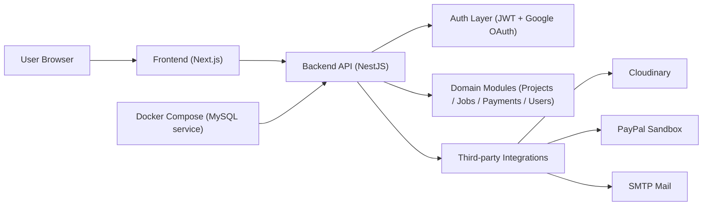

# AHP Business Hub

[](https://github.com/Benlaptrinh/AHP-Business-Hub/actions/workflows/ci.yml)


Fullstack platform for a construction business, combining:
- A public website (marketing + content pages)
- A role-based admin dashboard (Projects / Jobs / Payments / Users)
- A NestJS API layer for auth, authorization, and business workflows

## TL;DR (60-second scan)
- Monorepo with `Frontend` (Next.js) + `Backend` (NestJS)
- JWT auth + Google OAuth flow with role-based access control (admin/user)
- Admin panel supports full CRUD across core modules
- Integrations: Cloudinary upload, PayPal sandbox payment, SMTP mail
- CI pipeline runs lint/test/build for both apps on push/PR

## Live Demo
- Frontend demo: [web-app-one-orpin.vercel.app](https://web-app-one-orpin.vercel.app/)
- Backend local: `http://localhost:8080`

## Key Features
- Public website and admin dashboard in one unified product
- RBAC guards at API layer (`admin` vs `user`)
- Google OAuth (backend redirect flow) + JWT session handling
- RESTful API endpoints for projects/jobs/payments/users
- Admin CRUD with validation and error handling
- Payment workflow with PayPal sandbox capture
- Media upload endpoints via Cloudinary
- Test email/receipt delivery via SMTP

## System Architecture


## Repository Structure
```text
.
├── Frontend/                 # Next.js + TypeScript app
├── Backend/                  # NestJS + TypeScript API
├── .github/workflows/        # CI workflow
├── docs/                     # Setup, API, RBAC, deploy notes
├── docker-compose.yml        # Local MySQL service
├── CONTRIBUTING.md
├── SECURITY.md
└── README.md
```

## Tech Stack
- Frontend: Next.js, React, TypeScript, TailwindCSS, Framer Motion, Swiper
- Backend: NestJS, TypeScript, class-validator, JWT, Google OAuth
- Integrations: Cloudinary, PayPal Sandbox, Nodemailer (SMTP)
- Data/Infra: Docker Compose (MySQL service)
- Dev Workflow: GitHub Actions, ESLint, Jest

## Quick Start
### 1) Prerequisites
- Node.js 18+
- npm 9+
- Docker (optional, for local MySQL service)

### 2) Install dependencies
```bash
git clone https://github.com/Benlaptrinh/AHP-Business-Hub.git
cd AHP-Business-Hub

cd Frontend && npm install
cd ../Backend && npm install
cd ..
```

### 3) Configure env
```bash
cp Frontend/.env.example Frontend/.env.local
cp Backend/.env.example Backend/.env
```

### 4) Start local MySQL (optional)
```bash
docker compose up -d
```

### 5) Run backend + frontend
```bash
# Terminal 1
cd Backend
npm run start:dev

# Terminal 2
cd Frontend
npm run dev
```

- Frontend: `http://localhost:3000`
- Backend: `http://localhost:8080`

## API Quick Examples
### Dev login (local)
```bash
curl -X POST http://localhost:8080/auth/dev-login \
  -H "Content-Type: application/json" \
  -d '{"email":"admin@anhongphat.vn","name":"Dev Admin"}'
```

### Current user profile
```bash
curl http://localhost:8080/auth/me \
  -H "Authorization: Bearer <ACCESS_TOKEN>"
```

### Admin stats (example: projects)
```bash
curl http://localhost:8080/projects/stats \
  -H "Authorization: Bearer <ACCESS_TOKEN>"
```

More API details: [docs/api-conventions.md](./docs/api-conventions.md)

## CI / Quality
GitHub Actions workflow: [`.github/workflows/ci.yml`](./.github/workflows/ci.yml)
- Frontend: `npm ci`, `npm run lint`, `npm run build`
- Backend: `npm ci`, `npm run lint`, `npm run test -- --runInBand`, `npm run build`

Run locally:
```bash
# Frontend
cd Frontend && npm run lint && npm run build

# Backend
cd Backend && npm run lint && npm run test && npm run build
```

## Documentation
- [Frontend Setup](./docs/frontend-setup.md)
- [Backend Setup](./docs/backend-setup.md)
- [Authentication Flow](./docs/authentication-flow.md)
- [RBAC Matrix](./docs/rbac-matrix.md)
- [Docker Guide](./docs/docker-guide.md)
- [Testing Strategy](./docs/testing-strategy.md)
- [Deployment Checklist](./docs/deployment-checklist.md)
- [Troubleshooting](./docs/troubleshooting.md)

## Notes
- Current backend provides working API modules and integrations.
- MySQL service is provisioned via Docker Compose for local environment consistency.

## Contributing
Please read [CONTRIBUTING.md](./CONTRIBUTING.md) before opening a pull request.

## Security
If you find a vulnerability, please follow [SECURITY.md](./SECURITY.md).
